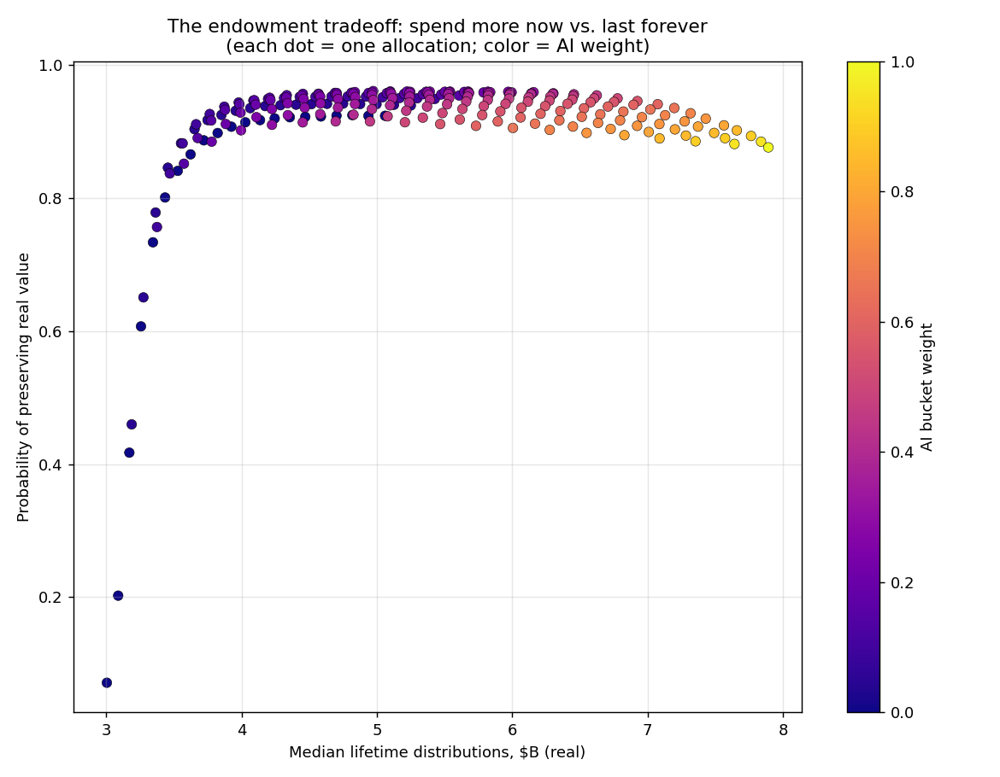
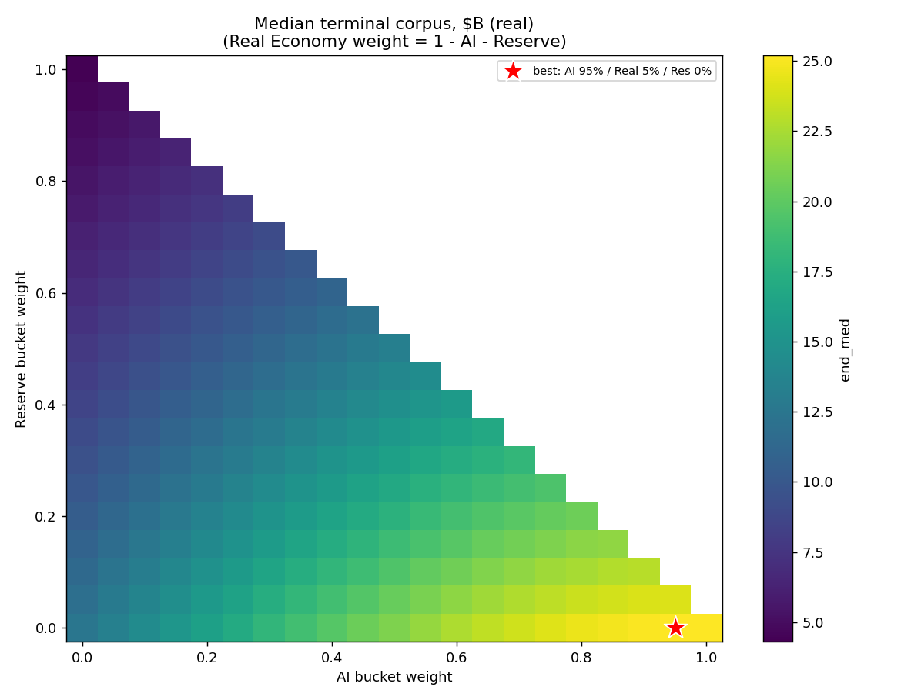
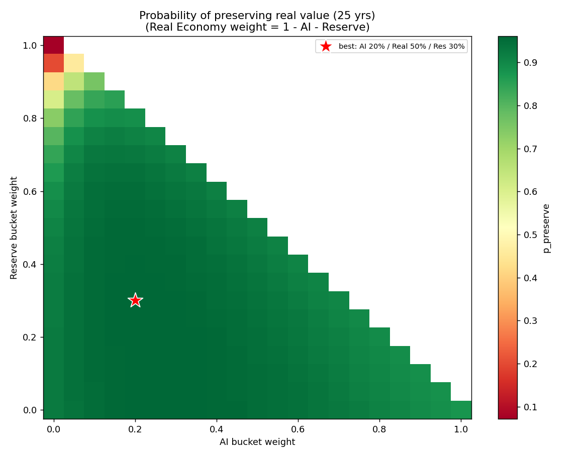

# AI Dividend Fund — Endowment Monte Carlo

An easy-to-use Monte Carlo simulator for a hypothetical **$5B "AI Dividend Fund" endowment**, modeled as three buckets (AI / Real Economy / Reserve) with correlated lognormal returns, annual rebalancing, and a smoothed (Yale-style) spending rule.

There are two ways to use it:

| File | What it is |
|------|------------|
| **`ai_endowment_tool.html`** | A self-contained interactive tool. **Just double-click it** — it opens in any browser, no install or internet needed. Drag sliders to explore one allocation, or run the full allocation sweep. |
| **`montecarlo.py`** | A Python version that sweeps every allocation and writes a results CSV plus charts. Run with `python3 montecarlo.py`. |

## The interactive tool

**Explorer tab** — pick an allocation with sliders and instantly see:
- a fan chart of the corpus over 25 years (percentile bands, real $),
- the annual distribution path,
- the distribution of terminal outcomes,
- headline stats and four downside-risk measures.

**Allocation Sweep tab** — runs all allocations against one shared set of futures and shows:
- the tradeoff frontier (lifetime payout vs. preserving real value),
- heatmaps of terminal corpus and a selectable risk surface,
- a "best allocation for each objective" table,
- an editable head-to-head reference table (add your own mixes).

Everything can be **downloaded to Excel/CSV** (projection, sweep grid, comparison).

## Base assumptions

| Bucket | Mean return | Volatility |
|--------|-------------|-----------|
| AI | 13% | 30% |
| Real Economy | 7% | 13% |
| Reserve | 2% | 2% |

Correlations: AI–Real 0.45, AI–Reserve 0.00, Real–Reserve 0.10.
Corpus $5B · 25-year horizon · 2.5% base spend rate · 0.70 smoothing · 10,000 simulations.

All assumptions are editable — in the tool via sliders, in the script via the `CONFIG` block at the top.

## Risk measures

- **Cut distributions** — payout falls >25% below its prior high-water mark in any year.
- **Worst cut depth** — the deepest such dip (median path).
- **Capital impairment** — ending corpus below the starting corpus (nominal).
- **Severe impairment** — a peak-to-trough corpus drawdown of more than 50% at any point.

## Example output

---

*Educational model of a hypothetical fund. Assumptions are illustrative, not investment advice.*
